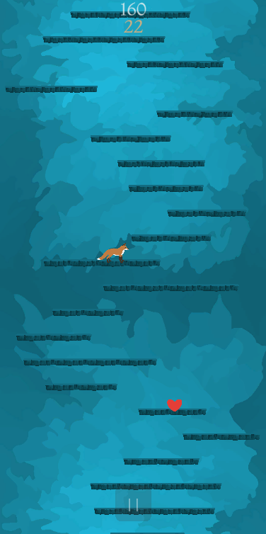

# 2D Infinite Scroller 
## About
2D Infinite Scroll Platformer videogame being developed in the Unity game engine.
The gameplay is quite simple, consisting of jumping from platform to platform at the same pace the camera moves, which increases its speed over time.

Project's Unity version: 2022.2.15f1

### Features:
* Character controller allowing for movement, jumping and bouncing.
* Random level generation with platforms of different sizes and parallax background.
* Difficulty system increasing the speed of the camera and reducing the size of the platforms over time.
* Scoring based on character jumps and combo multipliers.
* UI elements such as score, pause menu and game over screen.
* Core game events such as starting, pausing, continuing and game over.
* Camera with different effects and transitions depending on the game state.
* Utilization of services for leaderboards, rewarded ads.

### Demo:
[Download For Windows](https://github.com/franpereira/InfiniteScroller/releases/download/Demo/InfiniteScroller-Win.zip)

